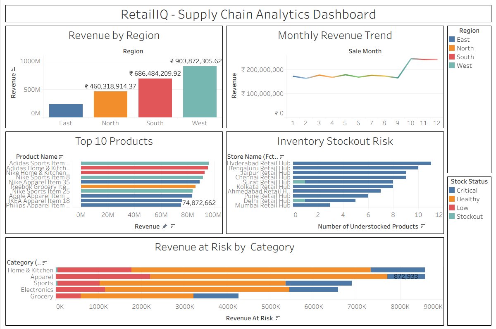
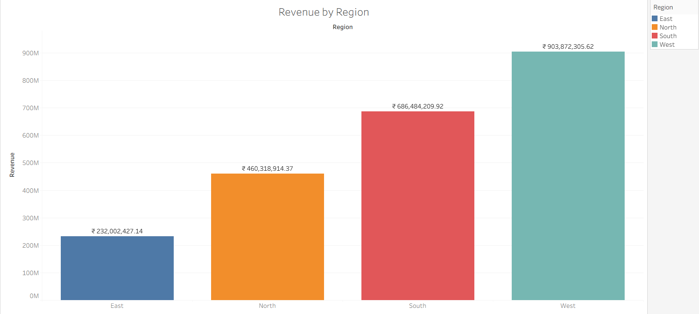
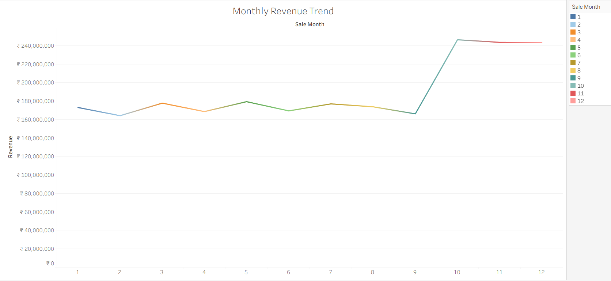
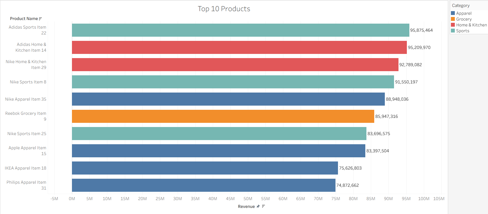
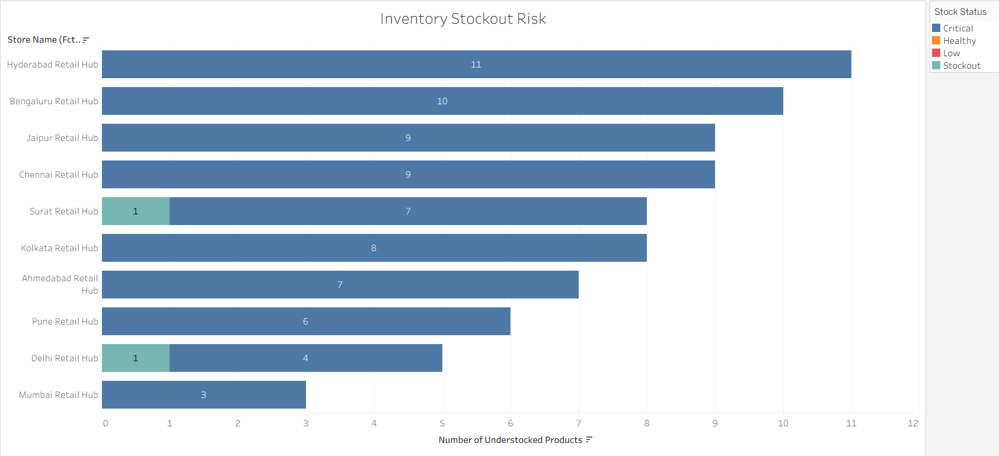
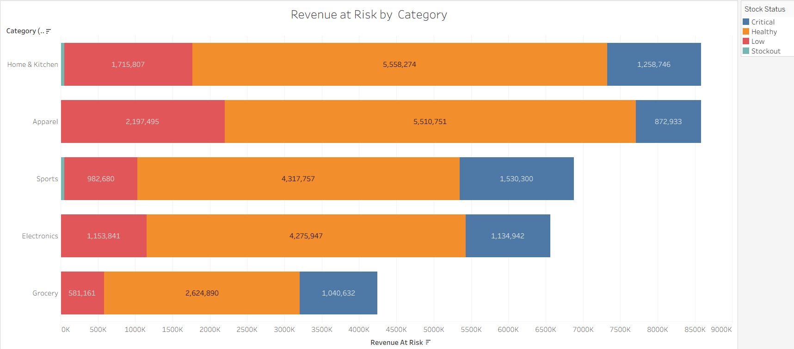

# RetailIQ — Supply Chain Analytics & AI Decision Platform

**A production-grade analytics platform that gives retail leadership a single place to monitor revenue, inventory health, and stockout risk across a 10-store network — paired with a conversational AI assistant that answers any business question in plain English, in under 5 seconds.**

[](https://python.org)
[](https://fastapi.tiangolo.com)
[](https://getdbt.com)
[](https://cloud.google.com/bigquery)
[](https://tableau.com)
[](https://console.groq.com)

---

## Situation

Retail and supply chain leadership typically rely on periodic, manually prepared reports to understand store performance, regional demand, and inventory health. This creates two recurring problems: insights arrive too late to act on, and any question outside the pre-built report (*"which products are about to run out?"*, *"which store needs attention this week?"*) requires a fresh request to an analyst — adding days of delay before a decision can be made.

## Task

Build a live analytics layer on top of the company's sales and inventory data, paired with a natural-language AI assistant, so that any authorized stakeholder can ask a business question directly and get an accurate, data-grounded answer immediately — with no SQL, no dashboard navigation, and no waiting on an analyst.

## Action

- **Data Engineering:** Generated and ingested 91,690 transaction records (365 days, 10 stores, 50 products) into **Google BigQuery**, then modeled them into governed analytical tables using **dbt Core** — `fct_sales_daily`, `fct_inventory_health`, and `agg_store_performance`.
- **Executive Dashboard:** Built a 5-report **Tableau** dashboard covering regional revenue, monthly trends, top-performing products, stockout risk by store, and revenue at risk by category — connected live to BigQuery.
- **AI Business Assistant:** Built a **FastAPI** web application powered by **Groq's LLaMA 3.3 70B**, which converts a plain-English question into a governed BigQuery SQL query, executes it, and returns both the answer and a recommended business action — all in a modern glassmorphism UI.
- **Data Validation:** Before finalizing any reported figure, every number was independently cross-checked against its source data rather than trusted at face value. This surfaced and fixed two real defects (detailed below) — the kind of diligence that should precede any number reaching a decision-maker.

## Result

- Identified that the **West region generates ~4× the revenue of the East region** — a clear signal for where to focus expansion investment.
- Found that **festive-season months (Oct–Dec) contribute ~₹73.34 crore**, nearly a third of annual revenue — directly informing when inventory and staffing plans should begin.
- Flagged **70 understocked SKUs** across the network, with Hyderabad and Bengaluru carrying the highest concentration of risk.
- Reduced the time to answer an ad-hoc business question from a multi-day analyst request to **under 5 seconds**, via the AI assistant.

---

## Executive Dashboard

<p align="center"></p>

| Revenue by Region | Monthly Revenue Trend |
|---|---|
|  |  |

| Top 10 Products | Inventory Stockout Risk |
|---|---|
|  |  |

**Revenue at Risk by Category**
<p align="center"></p>

---

## AI Business Assistant

Ask any supply chain question in plain English — the assistant generates the SQL, queries BigQuery, and returns a business insight instantly.

> Built with **FastAPI** + **Groq LLaMA 3.3 70B** + **Google BigQuery**  
> Modern dark glassmorphism UI — no SQL knowledge required

**Example questions you can ask:**
- *"Which store has the highest total revenue?"*
- *"Which products have stock status as Stockout?"*
- *"Which region has the highest total revenue?"*
- *"Compare festive vs non-festive revenue by store"*
- *"Which products have days of supply less than 7?"*

---

## Data Integrity: A Finding Worth Sharing

Before finalizing any number in this project, every reported figure was checked against its source data rather than taken at face value from a dashboard or aggregation table.

> **Found:** One store's revenue in an aggregation table was overstated by **10×** (₹23.30 Cr reported vs. ₹2.33 Cr actual), traced to a stale materialized view that hadn't been rebuilt after a logic correction.
>
> **Fixed:** Rebuilt the model from current logic and verified it line-by-line against source data across all 10 stores. A second issue — BigQuery silently serving cached query results even after the rebuild — was also identified and permanently resolved by disabling query caching at the client level.

This is documented deliberately. Catching a materially wrong number before it reaches a decision-maker is exactly the kind of rigor this project is meant to demonstrate.

---

## Tech Stack

| Layer | Tools |
|---|---|
| Data Generation & Ingestion | Python (pandas, NumPy) |
| Data Warehouse | Google BigQuery |
| Transformation | dbt Core 1.12 (BigQuery adapter) |
| Visualization | Tableau |
| AI Assistant Backend | FastAPI + Groq LLaMA 3.3 70B |
| AI Assistant Frontend | HTML, CSS, Vanilla JS (glassmorphism UI) |
| Version Control | Git & GitHub |

---

## Repository Structure

```
RetailIQ-Supply-Chain-Analytics/
├── raw_data/                  # Source CSVs (products, stores, sales, inventory)
├── data_pipeline/             # Data generation & BigQuery load scripts
├── dbt_retailiq/retailiq/     # dbt project (staging + analytics models)
├── fastapi_app/               # AI Business Assistant (FastAPI backend + web UI)
│   ├── main.py                # FastAPI app — /api/ask, /api/sql, /api/health
│   └── static/                # index.html, style.css, app.js
├── Charts/                    # Tableau dashboard exports
├── RetailIQ_Dashboard.twb     # Tableau workbook
├── .env.example               # Required environment variables template
├── requirements.txt
└── README.md
```

---

## Running Locally

```bash
# 1. Clone the repo
git clone https://github.com/sumitkumarbarnwal/Retail-supply-chain-analytics.git
cd Retail-supply-chain-analytics

# 2. Set up the environment
python -m venv .venv
.venv\Scripts\Activate.ps1        # Windows
# source .venv/bin/activate        # macOS/Linux
pip install -r requirements.txt

# 3. Add your credentials
cp .env.example .env
# Edit .env and set GROQ_API_KEY=your_key_here
# Then authenticate Google Cloud:
gcloud auth application-default login

# 4. Build the dbt models (requires BigQuery access)
cd dbt_retailiq/retailiq
dbt run
cd ../..

# 5. Launch the AI assistant
uvicorn fastapi_app.main:app --reload
# Open http://localhost:8000
```

---

## Author

**Sumit Kumar Barnwal**

[](https://linkedin.com/in/sumitkumarbarnwal)
[](https://github.com/sumitkumarbarnwal)
